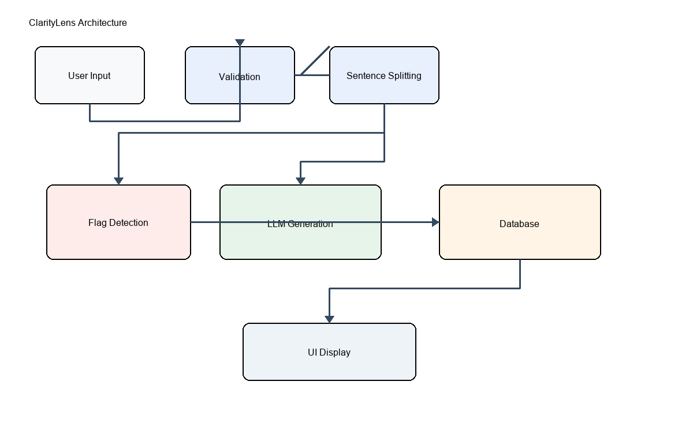

# ClarityLens Architecture

## Overview
ClarityLens is a single-page Streamlit application with three main layers:
a rule-based NLP analysis layer, an LLM-augmented generation layer, and a
local persistence layer.

## Data Flow

1. **Input** — User enters text (Analyze mode) or a decision description
   (Decision mode) via the Streamlit UI.

2. **Validation** (`nlp_utils.py`) — Input is checked for validity (not
   empty/symbols-only), sufficiency (decision mode requires 5+ words),
   length (truncated above 2000 words), and likely language (English
   detection via langdetect, warning only, non-blocking).

3. **Sentence Segmentation** (`nlp_utils.py`) — Valid text is split into
   individual sentences using NLTK's `sent_tokenize`.

4. **Rule-Based Flag Detection** (`flag_detector.py`) — Each sentence is
   scanned by three independent detectors:
   - Absolute language (keyword match against a curated list)
   - Emotional/loaded language (keyword match, with a context-aware tier
     that suppresses flags on long, technical sentences)
   - Missing source (statistical/claim pattern match combined with a
     negation-aware check for genuine source attribution)

5. **LLM-Augmented Generation** (`llm_utils.py`) — The full input text is
   sent to the Groq API (llama-3.1-8b-instant model) to generate:
   - A neutral, bias-stripped summary (Analyze mode)
   - The strongest opposing viewpoint / steelman argument (Analyze mode)
   - 3-4 Socratic follow-up questions (Decision mode)
   The API key is resolved from Streamlit secrets (cloud) or a local
   .env file (development). If no key is available, each function
   returns a friendly fallback message instead of failing.

6. **Persistence** (`database.py`) — Every completed analysis (input
   text, flags, summary, steelman/questions, timestamp) is saved to a
   local SQLite database. Supported operations: save, retrieve all,
   search by keyword, filter with sort order, delete one record, clear
   all records.

7. **Presentation** (`ui_helpers.py`, `app.py`) — Flags are rendered as
   color-coded HTML badges. The History tab reads from the database and
   displays past analyses in expandable cards, with search, sort, CSV
   export, and delete controls.

## Module Responsibility Summary

| Module | Responsibility |
|---|---|
| app.py | UI orchestration, ties all modules together |
| nlp_utils.py | Input validation, sentence splitting, language/length checks |
| flag_detector.py | Rule-based reasoning flag detection |
| llm_utils.py | Groq API integration for generative features |
| database.py | SQLite persistence layer |
| ui_helpers.py | HTML rendering helpers for flag display |

## Design Rationale
The system deliberately separates deterministic, explainable rule-based
checks (flag_detector.py) from generative AI output (llm_utils.py). This
means every flag shown to the user is fully auditable and reproducible,
while the LLM is used only where genuine language generation is needed
(summarization, counter-argument construction, Socratic questioning) -
tasks that cannot be done reliably with simple pattern matching.

## Visual Diagram

